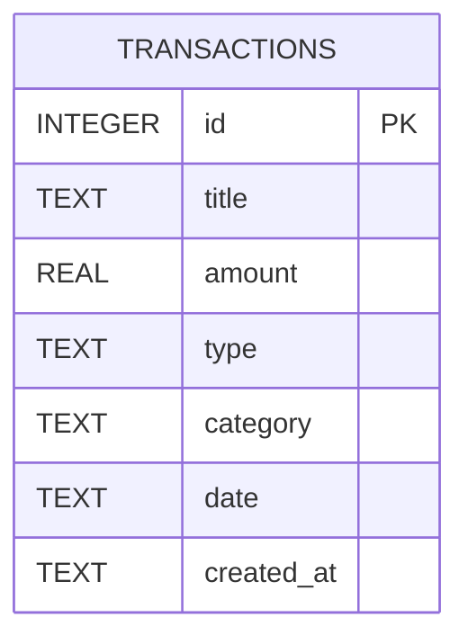

# 資料庫設計文件 (DB Design) - 個人記帳簿

## 1. ER 圖（實體關係圖）

## 2. 資料表詳細說明

### `transactions` (收支明細表)

儲存使用者輸入的每一筆收入與支出紀錄。

| 欄位名稱 | 型別 | 必填 | 說明 |
| --- | --- | --- | --- |
| `id` | INTEGER | 是 | Primary Key，自動遞增的唯一識別碼 |
| `title` | TEXT | 是 | 項目名稱 (例如：午餐、打工薪水) |
| `amount` | REAL | 是 | 金額，不能為負數 (前端及後端需進行驗證) |
| `type` | TEXT | 是 | 收支類型，僅允許 `income` (收入) 或 `expense` (支出) |
| `category` | TEXT | 是 | 分類標籤 (例如：飲食、交通、娛樂、學習、薪資等) |
| `date` | TEXT | 是 | 消費或收入發生的日期，使用 ISO 格式 (YYYY-MM-DD) |
| `created_at` | TEXT | 是 | 該筆紀錄寫入資料庫的時間戳記，預設為 `CURRENT_TIMESTAMP` |

> 此專案目前為單機個人記帳簿，因此暫時不需要 `users` 表格，所有紀錄都儲存於單一使用者的資料表中。

## 3. SQL 建表語法

請參考 `database/schema.sql`。

## 4. Python Model 程式碼

請參考 `app/models/database.py`，內含 SQLite3 連線邏輯與針對 `transactions` 資料表的 CRUD 操作方法。
