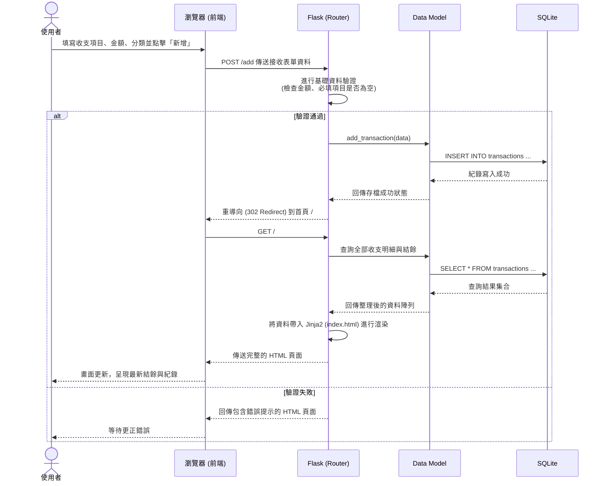

# 流程圖與資料流設計 (Flowchart) - 個人記帳簿

這份文件根據產品需求文件 (PRD) 與系統架構文件的內容，視覺化呈現使用者造訪系統的操作路徑與後端資料實際的流向。

## 1. 使用者流程圖 (User Flow)

此圖涵蓋了使用者從開啟網頁開始，執行包含日常記帳、分類選擇、編輯與預覽等核心操作的流動路徑。

```mermaid
flowchart LR
    Start([使用者開啟網頁]) --> Home[首頁 - 歷史紀錄與當前結餘總覽]
    
    Home --> Action{想要做什麼操作？}
    
    Action -->|新增記帳| AddForm[填寫新增記帳表單]
    AddForm --> SubmitAdd{送出儲存}
    SubmitAdd -->|資料正確| Home
    SubmitAdd -->|輸入錯誤| AddForm
    
    Action -->|編輯紀錄| EditForm[進入單筆修改頁面]
    EditForm --> SubmitEdit{修改或刪除送出}
    SubmitEdit -->|操作成功| Home
    SubmitEdit -->|操作失敗| EditForm
    
    Action -->|預覽所有分類/時間| ViewReport[切換分類濾鏡 (若有提供)]
    ViewReport --> Home
```

## 2. 系統序列圖 (Sequence Diagram)

以下序列圖以核心功能「提交新增記帳」為例，展示前端瀏覽器、Flask 後端與資料庫之間的完整通訊流。



## 3. 功能清單對照表

以下整理出本個人記帳系統預計實作的主要路由及對應方法。

| 功能名稱 | 具體描述與系統行為 | URL 端點 (Endpoint) | HTTP 方法 |
|:---|:---|:---|:---|
| **首頁 / 預覽清單 / 計算結餘** | 請求渲染記帳本首頁。讀取所有歷程與計算總支出 / 收入結餘。 | `/` | GET |
| **新增記帳表單**   | 取得填寫新增記帳項目（包含選擇內建分類）的網頁介面。 | `/add` | GET |
| **執行新增記帳**   | 接收 `/add` 的回傳資料，寫入資料庫並重導回首頁。 | `/add` | POST |
| **編輯單筆紀錄**   | 取得填寫編輯特定 ID 帳目的網頁介面，並帶入現有資料。 | `/edit/<id>` | GET |
| **執行更新紀錄**   | 接收對特定 ID 發送的更新請求並複寫資料庫。 | `/edit/<id>` | POST |
| **刪除單筆紀錄**   | 處理特定 ID 的刪除請求並即刻把該紀錄自資料庫移除。 | `/delete/<id>` | POST |
